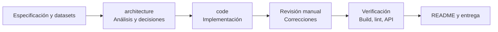

# Kontaktu · ficha de contactos

Implementación del reto técnico de Kontaktu: una ficha de contacto para un CRM inmobiliario AI-first, construida con Next.js App Router, TypeScript y CSS propio.

El objetivo principal es mostrar contactos reales y heterogéneos sin romper la interfaz: datos incompletos, fechas en distintos formatos, teléfonos inconsistentes, cualificación dinámica y procedencias diferentes.

## 1. Requisitos

- Node.js 18.17 o superior.
- npm 9 o superior.
- Navegador moderno.

No se necesitan variables de entorno para ejecutar la demo.

## 2. Ejecución local paso a paso

Desde la raíz del proyecto:

```bash
npm install
npm run dev
```

Abrir:

```text
http://localhost:3000/contacts
```

La ruta `/contacts` muestra el listado auxiliar. Al seleccionar un registro se abre la ficha:

```text
http://localhost:3000/contacts/c-001
```

Contactos útiles para revisar los casos límite:

| Contacto | Caso que demuestra                                              |
| -------- | --------------------------------------------------------------- |
| `c-001`  | Ficha rica, llamada, transcripción, arrays, objetos y booleanos |
| `c-003`  | `qualification_data` recibido como string JSON                  |
| `c-004`  | Sin nombre y solo actividad de WhatsApp                         |
| `c-005`  | Sin teléfono, formulario web y preferencia por email            |
| `c-008`  | Dato editado manualmente y campos adicionales                   |
| `c-009`  | Posible duplicado de `c-001`                                    |
| `c-012`  | Contacto prácticamente vacío y fecha epoch                      |
| `c-013`  | Restricción “no llamar” y contacto solo por email               |
| `c-015`  | Email inválido y fecha europea                                  |
| `c-016`  | Handoff solicitado a una persona                                |

Para detener el servidor de desarrollo, usar `Ctrl + C`.

## 3. Comandos de verificación

Ejecutar estos comandos antes de entregar cambios:

```bash
npm run typecheck
npm run lint
npm run build
git diff --check
```

Para probar la versión compilada:

```bash
npm run build
npm start
```

## 4. Arquitectura

El proyecto separa los datos originales de la representación que consume la interfaz:

```text
src/data/contactos.json
        ↓
RawContact
        ↓
normalizeContact()
        ↓
reglas de duplicados y cumplimiento
        ↓
ContactViewModel
        ↓
Route Handlers y componentes React
```

### Estructura principal

```text
src/
├── app/
│   ├── api/contacts/             # API de contactos
│   ├── contacts/                 # Listado y detalle
│   ├── globals.css               # Sistema visual de la demo
│   └── layout.tsx
├── components/
│   ├── contact-detail.tsx        # Ficha completa
│   └── contacts-list.tsx         # Listado auxiliar
├── data/
│   ├── contactos.json
│   └── kb-propiedades-voz.json
├── lib/contacts/
│   ├── normalize.ts              # Parseo y normalización
│   ├── repository.ts             # Lectura server-side del JSON
│   └── rules.ts                  # Duplicados y cumplimiento
└── types/contact.ts              # Contratos RawContact y ViewModel
```

El JSON se lee únicamente desde el servidor mediante `repository.ts`. La UI consume la API y no importa directamente el dataset.

## 5. API disponible

### `GET /api/contacts`

Devuelve todos los contactos normalizados. Incluye una latencia simulada para que los estados de carga sean observables.

### `GET /api/contacts/:id`

Devuelve la ficha normalizada de un contacto.

- `200`: contacto encontrado.
- `404`: contacto inexistente.
- `500`: error de lectura o parseo del dataset.

## 6. Funcionalidades implementadas

### Normalización

- Teléfonos con `+34`, `0034`, espacios, guiones o formato local.
- Fechas ISO, `DD/MM/YYYY`, `DD/MM/YYYY HH:mm` y epoch en segundos.
- Canales como `VOICE_CALL`, `VOICE`, `VOZ`, `llamada`, `WHATSAPP`, `WITEI` y `WEBSITE`.
- Nombres en mayúsculas o minúsculas.
- Emails ausentes o inválidos, sin eliminar el valor original.
- `qualification_data` como objeto, `null` o string JSON.

### Cualificación dinámica

La ficha no depende de un conjunto fijo de campos. Recorre las claves disponibles y las agrupa en:

- Compra (`sale`).
- Alquiler (`rental`).
- Datos comunes (`shared`).
- Otros datos desconocidos.

Cada hecho muestra valor, procedencia, fecha y referencia cuando existe. Los campos desconocidos no se descartan.

### Timeline

Las llamadas, mensajes de WhatsApp, formularios y emails se normalizan y ordenan cronológicamente. Las transcripciones de llamadas aparecen plegadas para no saturar la ficha.

### Historias de usuario elegidas

1. **Posibles duplicados**: se comparan teléfonos normalizados y emails válidos dentro de la misma organización. No se ejecuta una fusión automática.
2. **Edición de cualificación**: el valor editado pasa a ser humano, conserva el valor anterior en el historial y se mantiene en estado local del navegador.
3. **Cumplimiento**: señales explícitas como `no-llamar` o “solo por email” muestran una alerta y deshabilitan las acciones restringidas.

La preferencia normal de `c-005` por email no se trata como una prohibición. En cambio, `c-013` sí queda bloqueado para llamada y WhatsApp.

## 7. Decisiones sobre datos sucios

- La procedencia se interpreta con cautela: `manual` se muestra como humano, `explicit` como extracción automatizada y `import-witei` como importado.
- No se intenta reconstruir historial desde texto libre. Si una edición no tiene historial estructurado, se conserva el historial desde el momento de la edición local.
- Un contacto sin nombre utiliza teléfono, email o el fallback `Contacto sin nombre`.
- Un email inválido se conserva y se puede mostrar como advertencia; no se usa para detectar duplicados.
- La ausencia de consentimiento no se interpreta como consentimiento legal. Solo se bloquean restricciones explícitas del dataset.
- El dataset contiene contactos de `ORG-0031` y `ORG-0047`; las reglas de duplicados evitan comparar contactos de organizaciones diferentes.

## 8. Forma de trabajo agentica

El desarrollo se organizó en fases y con responsabilidades separadas:



### Fase 1 — Análisis arquitectónico

Se delegó un análisis al agente `architecture` con la especificación técnica y los datasets. El análisis identificó:

- La separación `RawContact → normalización → ViewModel`.
- Los casos críticos del dataset.
- La selección de duplicados, edición humana y cumplimiento.
- El riesgo de mezclar organizaciones.
- Los límites de una edición local sin persistencia.

### Fase 2 — Implementación

Se delegó al agente `code` la creación del scaffold completo, las rutas API, la ficha, el listado, los estados y el README inicial.

### Fase 3 — Revisión del resultado

La revisión manual del resultado detectó y corrigió estos problemas:

- La preferencia simple de email se interpretaba erróneamente como bloqueo.
- `sourceRef: import-witei` no se reflejaba como procedencia importada.
- Los teléfonos vacíos podían generar razones incorrectas de duplicado.
- Los duplicados no filtraban explícitamente por organización.
- Los campos adicionales de `c-008` no aparecían en la cualificación.
- La capitalización de nombres con acentos producía resultados como `SofíA MaríN`.

### Fase 4 — Verificación

Se ejecutaron typecheck, lint, build, revisión de whitespace y una prueba de humo contra la API. La prueba confirmó:

- 16 contactos devueltos por `/api/contacts`.
- `c-001` enlazado con `c-009` como duplicado.
- `c-013` con llamada y WhatsApp bloqueados.
- `c-005` sin bloqueo por su preferencia normal de email.
- `c-012` renderizable como contacto vacío.
- Un ID inexistente responde con `404`.

## 9. Tiempo de trabajo efectivo

El resultado completo documentado en este repositorio se resolvió dentro de esta conversación. El tiempo de trabajo efectivo estimado de Codex y de los agentes delegados fue de aproximadamente **15 minutos**.

La estimación cubre:

- Lectura de la especificación y datasets adjuntos.
- Análisis arquitectónico delegado.
- Implementación del scaffold y funcionalidades.
- Revisión y correcciones posteriores.
- Configuración de lint.
- Verificaciones técnicas y prueba de API.
- Documentación final de este README.

La cifra incluye todo el trabajo activo realizado en esta conversación: análisis, coordinación de agentes, implementación, revisión, correcciones, configuración de lint, verificaciones técnicas, prueba de API y documentación final. Es una estimación basada en la ejecución de herramientas y agentes; no incluye el tiempo de espera entre resultados ni el intervalo de reloj completo de la conversación.

## 10. Límites conocidos y siguiente iteración

No se implementaron:

- Persistencia real de ediciones.
- Fusión real de duplicados.
- Matching con `kb-propiedades-voz.json`.
- Agente de voz LiveKit.
- Autenticación y autorización por organización.
- Paginación o búsqueda avanzada.
- Tests unitarios automatizados.

La siguiente iteración recomendable sería añadir persistencia auditada para las ediciones, tests unitarios de normalización y autorización por organización antes de usar datos reales.

## 11. Nota de dependencias

La aplicación compila y funciona con Next.js `14.2.31`. `npm audit --omit=dev` reporta vulnerabilidades altas asociadas a esa rama de Next.js y PostCSS. No se aplicó `npm audit fix --force` porque propone una actualización mayor con cambios de compatibilidad; para producción se debe planificar esa actualización explícitamente.
